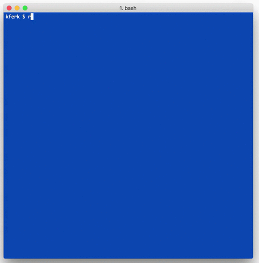
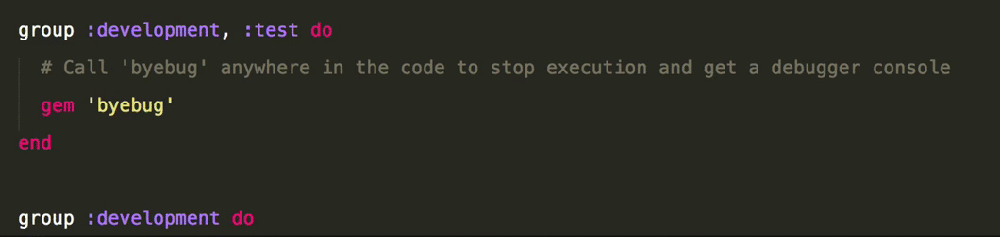
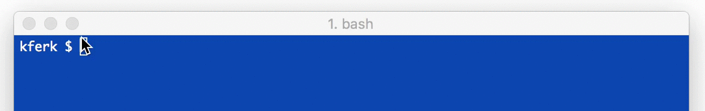
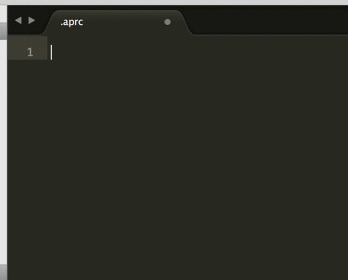

#<a href="https://github.com/michaeldv/awesome_print" style="text-decoration: none" target="_blank">awesome print</a>
<hr>
##overview
Created by Michael Dvorkin, <strong>Awesome Print</strong> is a Ruby Gem/Library that enables "pretty printing" for your Rails objects and data in IRB. The results are presented in full color, with specified indentation and structured just as it is formatted in your application and database. 

So where you might be using p, inspect or pp to view your information, or defaulting to a base command, such as User.all, which provides the information unformatted and in a block, you can use <strong>Awesome Print</strong> and read it as you created it! Another key feature is that <strong>Awesome Print</strong> will show the index numbers whenever an array is passed in for even easier and more detailed viewing.

<strong>Awesome Print</strong> can also integrate into Active Record objects or Rails templates. Just use one of the [featured mixins below](#mixins) wherever you choose.

Dare to get even more costumizable or increase ease of use? <em>(Dare! Dare!)</em> All of the default viewing options are easily tailored, from indentation and limit to multiline and even the colors displayed. And to make the experience of <strong>Awesome Print</strong> even more, shall I say <strong>"awesome"</strong>, read below about how to make it the [default for any project](#default) with the gem installed.
<br><br>
<hr>
##how do i install <a href="https://github.com/michaeldv/awesome_print" style="text-decoration: none" target="_blank">awesome print?</a>
It's really as easy as any other gem and can be done in two easy ways...
<br><br>
<strong>as a Ruby gem in Terminal</strong><br>
<br>
````
	$ gem install awesome_print
````
<br><strong>or buy cloning the repository <a href="https://github.com/michaeldv/awesome_print" style="text-decoration: none" target="_blank">from Michael's GitHub page</a></strong><br>
<br>
```
	$ git clone git://github.com/michaeldv/awesome_print.git
```
<br>
<hr>
##but what does <a href="https://github.com/michaeldv/awesome_print" style="text-decoration: none" target="_blank">awesome print</a> do again?
###let's see it in action. 
We can start by taking a look at what happens when we search all of your users in your database by simply entering the stock command in Rails Console/IRB of User.all
<br><br>
 
> <dd> *ok, but not easily read, or awesome.*

<br>
###activate it.
Now how about we add <strong>Awesome Print</strong> to your GemFile...

Place the line
```ruby
	gem "awesome_print", require:"ap"
```
in the development/test section of your Gemfile
<br><br>

> <dd> *fine, go ahead and copy and paste.*

<br>
Next we need to run bundle install in terminal...
<br><br>

> <dd> *more gems then a jewelry store.*

<br>
And then we try out terminal again, but this time in Rails Console/IRB we  `require "awesome_print"`
and on the next line add `ap` then enter your request to list all of your users...
<br><br>

> <dd> **_now that is the way to display information._**

<br>
Now you can continue that same method to list any information you like.
<br>
<br>
<hr>
## what are <a href="https://github.com/michaeldv/awesome_print" style="text-decoration: none" target="_blank">awesome print's</a> defaults and can i style them?

Great, great question, lets have a look. First at the default values and their presets.

###defaults.
```ruby
:indent     => 4,      # Indent using 4 spaces.
:index      => true,   # Display array indices.
:html       => false,  # Use ANSI color codes rather than HTML.
:multiline  => true,   # Display in multiple lines.
:plain      => false,  # Use colors.
:raw        => false,  # Do not recursively format object instance variables.
:sort_keys  => false,  # Do not sort hash keys.
:limit      => false,  # Limit large output for arrays and hashes. Set to a boolean or integer.
:color => {
  :args       => :pale,
  :array      => :white,
  :bigdecimal => :blue,
  :class      => :yellow,
  :date       => :greenish,
  :falseclass => :red,
  :fixnum     => :blue,
  :float      => :blue,
  :hash       => :pale,
  :keyword    => :cyan,
  :method     => :purpleish,
  :nilclass   => :red,
  :rational   => :blue,
  :string     => :yellowish,
  :struct     => :pale,
  :symbol     => :cyanish,
  :time       => :greenish,
  :trueclass  => :green,
  :variable   => :cyanish
}
```
Now, if you prefer, here is a list of other colors that can be used in place of any current values.
```ruby
:gray, :red, :green, :yellow
:blue, :purple, :cyan, :white
:black, :redish, :greenish, :yellowish
:blueish, :purpleish, :cyanish, :pale
```
In order to set these new colors, or change any other default to a preference of your choosing, you will need to
create an ``.aprc`` file and save it into your home directory. When creating the file and your new defaults,
you must assign them to ``AwesomePrint.defaults``, like so...
<br><br>

> <dd> *sorry, no copying and pasting this time.*

<br>
<hr>
##<a name="default"></a>what if i want <a href="https://github.com/michaeldv/awesome_print" style="text-decoration: none" target="_blank">awesome print</a> to be my default in rails console and irb?

You are just full of good questions. 

In order to use <strong>Awesome Print</strong> as default formatter Rails Console/IRB add the following code to your ~/.irbrc file...

```ruby
	require "awesome_print"
	AwesomePrint.irb!
```
> <dd> *now what if you don't currently have an .irbc file in your user folder? simply create one in your editor of choice in a plain text file and save it to your user folder on your hard drive.*

<br>
<hr>
##<a name="mixins"></a>does <a href="https://github.com/michaeldv/awesome_print" style="text-decoration: none" target="_blank">awesome print</a> work well anywhere else in rails? or in another way?

There are a few more tricks. 
###logger convenience method
<strong>Awesome Print</strong> can integrate with the Logger Convenience Method when adding the 'ap' method to the Logger and ActiveSupport::BufferedLogger classes. This makes it possible for you to call...
```ruby
	logger.ap object
```
By default, this logs at the :debug level. You can override that globally with:
```ruby
	:log_level => :info
```
in the custom defaults (see below). You can also override on a per call basis with:
```ruby
	logger.ap object, :warn
```
###actionview convenience method
The ActionView Convenience Method is another spot <strong>Awesome Print</strong> can add the 'ap' method. Adding 'ap' to the ActionView::Base class makes available within Rails templates. Like so...
```ruby
	<%= ap @accounts.first %>   # ERB
	!= ap @accounts.first       # HAML
```
###html formatting
If you are working in Sinatra or other web frameworks, you can explicitly request HTML formatting...
```html
	<%= ap @accounts.first, :html => true %>
```

<br>
<hr>
##are there any other gems that <a href="https://github.com/michaeldv/awesome_print" style="text-decoration: none" target="_blank">awesome print</a> can work with?
How about maybe <a href="https://github.com/pry/pry" style="text-decoration: none" target="_blank">Pry</a>? <a href="https://github.com/pry/pry" style="text-decoration: none" target="_blank">Pry</a> is a great gem in and of itself for debuggin and other features, but with <strong>Awesome Print</strong> in tow, it makes viewing errors and fixing them just that much easier.

All you need to do is add the following snippet of code to your ~/.pryrc file...

```ruby
	require "awesome_print"
	AwesomePrint.pry!
```
<br>
<hr>
##conclusion
To say that <strong>Awesome Print</strong> is kind of awesome is just lazy. This gem will come in handy on any and every project you work on and will never leave your Gemfile again. So go and download it <a href="https://github.com/michaeldv/awesome_print" style="text-decoration: none" target="_blank">here</a>, and share and share.
